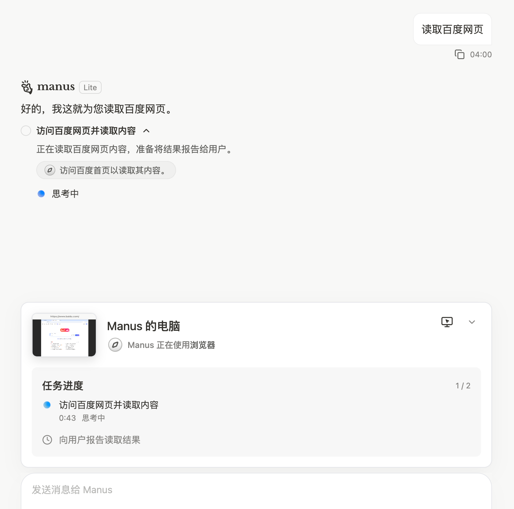
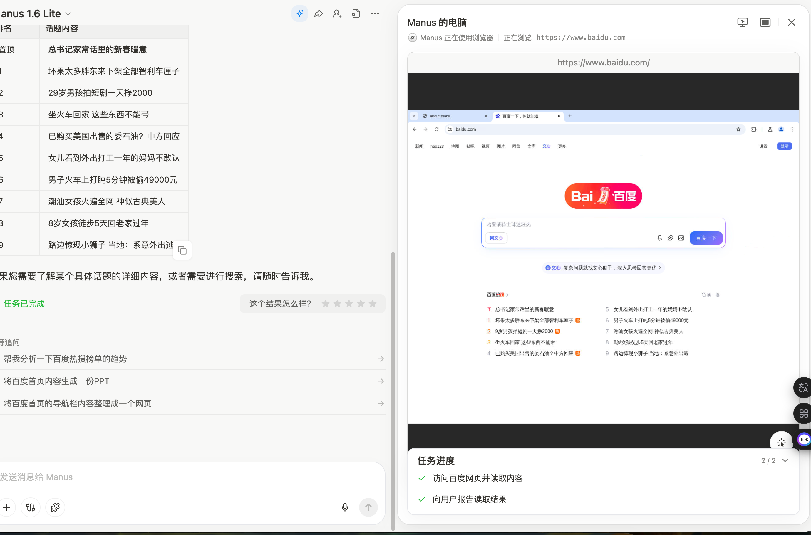

# Browser Fetch Service

一个独立的、支持高并发的网页抓取服务，使用 Playwright 实现。

[](https://hub.docker.com/r/zavierui/browser-fetch)
[](https://hub.docker.com/r/zavierui/browser-fetch)
[](https://hub.docker.com/r/zavierui/browser-fetch)
](https://hub.docker.com/r/zavierui/browser-fetch)

一个独立的、支持高并发的网页抓取服务，使用 **Playwright** 实现。

---

## 🚀 功能特性

- ⚡ **高并发** - 支持浏览器实例池 + 多页面并发
- 🔄 **内存管理** - 自动重启机制防止内存泄漏
- 📊 **健康检查** - 实时监控服务状态和资源使用
- 📸 **自动截图** - Base64 编码的整页 JPEG 截图
- 📝 **Markdown 输出** - 自动将 HTML 转换为 Markdown
- 🔧 **链接修复** - 自动将相对链接转换为绝对链接
- 🕵 **反爬虫** - 集成 playwright-stealth
- ⚙️ **异步架构** - 完全异步，无阻塞调用
- 🐳 **Docker支持** - 一键部署

---

## 📖 使用场景

### 🤖 AI 智能体网页抓取

本服务专为 **AI Agent** 和 **智能体** 设计，提供网页内容的结构化获取能力。AI Agent 可以通过简单的 API 调用，获取任何网页的：

- 📄 **Markdown 内容** - 用于 LLM 阅读和分析
- 🖼️ **页面截图** - 用于用户界面展示
- 📊 **元数据** - 标题、长度、抓取时间等

**工作原理：**
```
用户输入 → AI 接收 URL → 调用 Browser Fetch Service → 返回截图 + 内容 → AI 分析 → 回答用户
```

**实际效果：**
- 👁️ "看见"网页内容（通过截图）
- 🧠 理解网页结构（通过 Markdown）
- 💬 回答用户相关问题

---

### 🔍 内容采集与分析

自动化抓取网页内容供 AI 进行：

- 🔍 内容分析
- 🔑 关键信息提取
- 📊 数据挖掘

### 🏗 知识库构建

批量抓取网页并存储到向量数据库：

- RAG 系统的知识来源
- 企业知识库更新
- 行业资讯收集

---

## 📸 实际效果展示

**服务返回的数据结构：**


上图展示了本服务返回的完整数据：

- 🖼️ **左侧**：网页可视化截图（用户可直接查看）
- 📝 **右侧**：结构化 Markdown 内容（AI 可分析）
- 📊 **元数据**：标题、长度、抓取时间等

---

## 📖 使用场景

### 🤖 AI 智能体网页抓取

本服务专为 **AI Agent** 和 **智能体** 设计，提供网页内容的结构化获取能力。AI Agent 可以通过简单的 API 调用，获取任何网页的：

- 📄 **Markdown 内容** - 用于 LLM 阅读和分析
- 🖼️ **页面截图** - 用于用户界面展示
- 📊 **元数据** - 标题、长度、抓取时间等

**工作原理：**
```
用户输入 → AI 接收 URL → 调用 Browser Fetch Service → 返回截图 + 内容 → AI 分析 → 回答用户
```

---

**Manus** - 流行 AI 助手，用户可以让它"查看网页"并回答问题。



*用户：帮我看看这个网页在说什么*

**实际效果：**



AI 助手能够：
- 👁️ "看见"网页内容（通过截图）
- 🧠 理解网页结构（通过 Markdown）
- 💬 回答用户相关问题
- 📋 提取关键信息

---

## 🔄 工作流程

```
┌───────────── HTTP 请求      ┌──────────────
│  AI Agent   │
│      │       │
│      ↓       │
│ ┌─────────┐ │
│ │ Browser │ │
│ │ Fetch   │ │
│ │ Service │ │
│ └────┬────┘ │
│      │       │
└──────┼──────→ │
              │
              ↓
        ┌────────────┐
        │ JSON 响应  │
        └────────────┘
              │
              ↓
        ┌─────────────────┐
        │ 1. 发送 URL          │
        │ 2. 启动浏览器       │
        │ 3. 加载页面         │
        │ 4. 截图 + 转换       │
        │ 5. 返回 JSON         │
        └─────────────────┘
```

**用户看到：**
- 🖼️ 网页截图（可视化展示）
- 📝 Markdown 内容（可复制、可分析）
- 💬 AI 分析结果

---

## 💡 代码示例

### Python 调用示例

```python
import httpx

async def fetch_webpage_for_ai(url: str):
    """AI Agent 调用示例"""
    async with httpx.AsyncClient() as client:
        response = await client.post(
            "http://browser-fetch:2025/fetch_url",
            json={"url": url, "screenshot": True}
        )
        result = response.json()

        # 返回给 LLM 的结构化数据
        return {
            "title": result["title"],
            "content": result["markdown_content"],  # 给 LLM 阅读
            "screenshot": result["screenshot_base64"],  # 给用户看
            "fetched_at": result["fetched_at"]
        }

# 使用示例
async def main():
    result = await fetch_webpage_for_ai("https://example.com")
    print(result)
```

### cURL 调用示例

```bash
curl -X POST http://browser-fetch:2025/fetch_url \
  -H "Content-Type: application/json" \
  -d '{
    "url": "https://example.com",
    "wait_time": 1000,
    "screenshot": true,
    "block_media": true
  }'
```

---

## 🔗 链接自动修复

为方便 LLM 处理，服务会**自动修复 Markdown 内容中的相对链接**，确保所有链接都是完整可用的：

#### 修复类型

| 链接类型 | 修复前 | 修复后 |
|----------|--------|--------|
| Markdown 链接 | `[text](/abc)` | `[text](https://sample.com/abc)` |
| 协议相对路径 | `//cdn.com/lib.js` | `https://cdn.com/lib.js` |
| HTML href | `href="login"` | `href="https://sample.com/login"` |
| JavaScript 链接 | `javascript:void(0)` | `href="#"` |
| Markdown 图片 | `` | `` |
| 空链接 | `href=""` | `href="#"` |

#### 示例

假设抓取的页面是 `https://example.com/news/abc`，页面中有以下链接：

```markdown
[相对路径](/def/login)
[协议路径](//cdn.com/lib.js)
[空链接](href="")
[JavaScript](javascript:void(0))
```

服务会自动修复为：

```markdown
[相对路径](https://example.com/def/login)
[协议路径](https://cdn.com/lib.js)
[空链接](href="#")
[JavaScript](href="#")
```

**注意：** 链接修复在服务端自动完成，**无需额外处理**，LLM 可以直接使用返回的 Markdown 内容。

---

## ❓ 为什么要选择本服务？

| 特性 | 本服务 | 传统爬虫 | Playwright 直接使用 |
|------|----------|----------|------------------|
| **部署简单** | ✅ 一条命令启动 | ❌ 需要自己实现 | ❌ 需要自己管理浏览器 |
| **API 友好** | ✅ RESTful JSON | ❌ 需要自行封装 | ❌ 需要自己包装 |
| **并发支持** | ✅ 内置连接池 | ❌ 需要自己实现 | ❌ 需要自己管理 |
| **内存管理** | ✅ 自动重启防泄漏 | ❌ 容易泄漏 | ❌ 需要自己管理 |
| **Markdown 优化** | ✅ 自动转换 | ❌ 需要额外处理 | ❌ 需要额外处理 |
| **截图支持** | ✅ Base64 直接返回 | ❌ 需要额外工具 | ❌ 需要自己处理 |
| **反爬虫** | ✅ 集成 stealth | ❌ 需要自己实现 | ❌ 需要自己实现 |

---

## 🚀 快速开始

### 1. 安装依赖

```bash
# 使用 uvicorn（推荐）
pip install -r requirements.txt

# 或使用 pip
pip install fastapi uvicorn playwright
playwright install chromium
```

### 2. 配置环境变量

编辑 `.env` 文件：

```bash
# 服务配置
BROWSER_SERVICE_PORT=2025
BROWSER_SERVICE_HOST=0.0.0.0

# 浏览器配置
HEADLESS=true
BROWSER_POOL_SIZE=3          # 浏览器实例池大小
MAX_CONCURRENT_PAGES=10      # 每个实例的最大并发页面数
BROWSER_IDLE_TIMEOUT=5        # 空闲超时时间（秒），超时后重启浏览器

# 日志配置
LOG_LEVEL=INFO             # DEBUG, INFO, WARNING, ERROR, CRITICAL
```

### 3. 启动服务

```bash
# 方式一：使用启动脚本（推荐）
./start.sh

# 方式二：直接运行（自动使用 uvicorn）
python main.py
```

服务将在 `http://localhost:2025` 启动。

---

## 📡 API 文档

### 抓取网页

```http
POST /fetch_url
Content-Type: application/json

{
  "url": "https://example.com",
  "wait_time": 200,           // 可选：等待时间（毫秒）
  "wait_for_selector": ".content",  // 可选：等待选择器出现
  "screenshot": true,          // 可选：是否截图
  "block_media": true          // 可选：是否阻止图片/视频加载
}
```

**响应：**

```json
{
  "success": true,
  "fetched_url": "https://example.com",
  "title": "页面标题",
  "content": "# Markdown 内容",
  "screenshot": "base64编码的JPEG截图",
  "content_length": 1234,
  "fetched_at": "2026-02-13 12:00:00",
  "duration_seconds": 2.35
}
```

---

## 🔬 健康检查

### 健康状态

```http
GET /health
```

**响应：**

```json
{
  "status": "healthy",
  "browser_started": true,
  "pool_size": 3,
  "request_count": 42,
  "uptime_seconds": 3600
}
```

### 详细统计

```http
GET /stats
```

**响应：**

```json
{
  "service": {
    "name": "Browser Fetch Service",
    "version": "1.0.0",
    "uptime_seconds": 3600,
    "request_count": 42,
    "requests_per_second": 0.012
  },
  "browser_pool": {
    "pool_size": 3,
    "max_concurrent": 10,
    "initialized": true,
    "active_browsers": 2,
    "total_requests": 42
  },
  "memory": {
    "process_rss_mb": 45.2,
    "children_rss_mb": 1024.5,
    "total_rss_mb": 1069.7,
    "chromium_processes": 3,
    "chromium_details": [
      {"pid": 12345, "name": "chrome-headless-shell", "rss_mb": 150.2},
      {"pid": 12346, "name": "chrome-headless-shell", "rss_mb": 120.4}
    ]
  }
}
```

---

## 🐳 Docker部署

### 使用 DockerHub

```bash
docker pull zavierui/browser-fetch:latest
docker run -p 2025:2025 zavierui/browser-fetch:latest
```

### 构建镜像

```bash
docker build -t browser-fetch .
docker run -p 2025:2025 browser-fetch
```

---

## 📊 并发配置

服务使用两层并发控制：

1. **全局并发限制**：`BROWSER_POOL_SIZE × MAX_CONCURRENT_PAGES`
2. **每个浏览器实例**：最多 `MAX_CONCURRENT_PAGES` 个并发页面

**理论最大并发：**

| BROWSER_POOL_SIZE | MAX_CONCURRENT_PAGES | 理论最大并发 |
|-----------------|---------------------|----------------|
| 3 | 10 | **30** |
| 5 | 10 | **50** |
| 5 | 15 | **75** |

---

## 💾 内存管理

服务内置多项内存优化机制：

### 自动重启

- 浏览器空闲超过 `BROWSER_IDLE_TIMEOUT` 秒时自动重启
- 释放累积内存，保持服务稳定

### 资源拦截

默认阻止以下资源类型加载（可节省 40-60% 内存）：

- 图片 (`image`)
- 媒体文件 (`media`, `audio`, `video`)

**保留资源：**

- 样式表 (`stylesheet`)
- 脚本 (`script`)
- 字体 (`font`)
- 文档 (`document`)

### 内存估算

| 配置 | 最小内存 | 最大内存 | 峰值内存 |
|------|----------|----------|----------|
| POOL=2, CONCURRENT=3 | 300 MB | 500 MB | ~400 MB |
| POOL=3, CONCURRENT=10 | 600 MB | 900 MB | ~750 MB |
| POOL=5, CONCURRENT=10 | 1.5 GB | 2.5 GB | ~2 GB |

*以上估算已启用媒体拦截*

---

## 📈 监控端点

### 健康检查

```bash
curl http://localhost:2025/health
```

### 统计信息

```bash
curl http://localhost:2025/stats
```

### Prometheus 指标

```bash
curl http://localhost:2025/metrics
```

---

## 🔧 开发说明

### 项目结构

```
browser-fetch/
├── app.py                 # 主应用程序
├── main.py               # 启动入口
├── requirements.txt        # Python 依赖
├── .env                  # 环境配置
└── agent.md              # AI Agent 使用说明
```

### 核心组件

- **FastAPI** - Web 框架
- **Playwright** - 浏览器自动化
- **Markdownify** - HTML 转 Markdown
- **Rich** - 美化终端输出
- **Playwright Stealth** - 反爬虫检测

---

## 📄 许可证

MIT License
