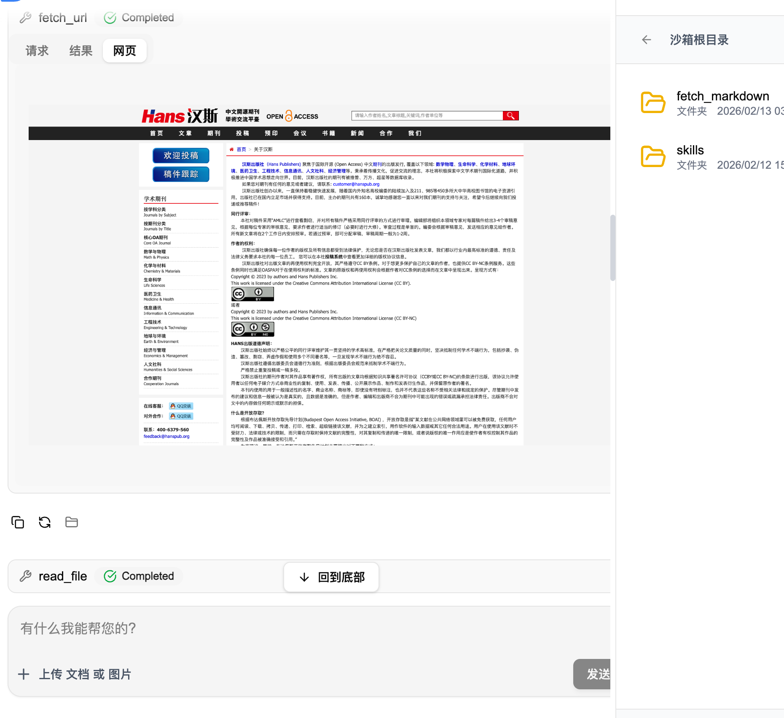

# 独立浏览器抓取服务

[](https://hub.docker.com/r/izerui/browser-fetch)
[](https://hub.docker.com/r/izerui/browser-fetch)

一个独立的、支持高并发的网页抓取服务，使用 Playwright 实现。

**Docker 镜像：** `izerui/browser-fetch`

```bash
docker pull izerui/browser-fetch:latest
```

## 功能特性

- 🚀 支持高并发（可配置浏览器实例数量）
- 🔄 自动重启机制（防止内存泄漏）
- 📊 健康检查端点
- 📸 自动截图（Base64 返回）
- 📝 Markdown 格式输出
- ⚡ 完全异步架构
- 🐳 Docker 支持

## 使用场景

### AI 智能体网页抓取

本服务专为 **AI Agent/智能体** 设计，提供网页内容的结构化获取能力。AI Agent 可以通过简单的 API 调用，获取任何网页的：

- 📄 **Markdown 内容** - 用于 LLM 理解和分析
- 🖼️ **页面截图** - 用于用户界面展示
- 📊 **元数据** - 标题、长度、耗时等

**典型应用：**

1. **AI 助手网页预览** - 类似 Manus 的网页截屏功能
2. **内容采集与分析** - 自动抓取网页供 AI 处理
3. **知识库构建** - 批量抓取并结构化存储
4. **竞品监控** - 定时抓取对手网页变化
5. **RAG 增强** - 实时获取网页内容补充检索

**示例展示：**



上图展示了 AI Agent 调用服务后的用户界面效果：
- 左侧显示网页截图
- 右侧显示提取的 Markdown 内容
- 用户可以直观地浏览和理解网页

**工作流程：**

```
┌─────────────┐     HTTP请求      ┌──────────────┐
│  AI Agent   │ ────────────────> │ Browser Fetch│
│  (Claude)   │ <──────────────── │   Service    │
└─────────────┘     JSON响应       └──────────────┘
       │                                │
       │ 1. 发送 URL                    │ 2. 启动浏览器
       │                                │ 3. 加载页面
       │                                │ 4. 截图 + 转换
       │                                │ 5. 返回 JSON
       ▼                                ▼
┌───────────────────────────────────────┐
│  用户看到：                            │
│  - 网页截图（可视化展示）               │
│  - Markdown 内容（可复制、可分析）       │
└───────────────────────────────────────┘
```

**代码示例：**

```python
import httpx
import base64

async def fetch_webpage(url: str):
    """AI Agent 调用示例"""
    async with httpx.AsyncClient() as client:
        response = await client.post(
            "http://browser-fetch:2025/fetch_url",
            json={"url": url, "screenshot": True}
        )
        result = response.json()

        # 返回给 AI 的结构化数据
        return {
            "title": result["title"],
            "content": result["markdown_content"],  # 给 LLM 阅读
            "screenshot": result["screenshot_base64"],  # 给用户看
            "fetched_at": result["fetched_at"]
        }
```

## 快速开始

### 1. 安装依赖

```bash
# 使用 uv（推荐）
uv sync

# 或使用 pip
pip install -e .
```

### 2. 安装 Playwright 浏览器

```bash
playwright install chromium
```

### 3. 启动服务

```bash
python main.py
```

服务将在 `http://localhost:2025` 启动。

## 环境变量

| 变量名 | 默认值 | 说明 |
|--------|--------|------|
| `BROWSER_SERVICE_PORT` | 2025 | 服务端口 |
| `BROWSER_SERVICE_HOST` | 0.0.0.0 | 服务主机 |
| `HEADLESS` | true | 无头模式 |
| `BROWSER_POOL_SIZE` | 5 | 浏览器实例池大小 |
| `MAX_CONCURRENT_PAGES` | 10 | 每个实例的最大并发页面数 |
| `MAX_SCREENSHOT_SIZE` | 5242880 | 最大截图大小（字节） |

## API 端点

### 健康检查
```
GET /health
```

响应示例：
```json
{
  "status": "healthy",
  "browser_started": true,
  "pool_size": 5,
  "max_concurrent": 10,
  "request_count": 42,
  "uptime_seconds": 3600.5,
  "memory": {
    "process_rss_mb": 45.2,
    "process_vms_mb": 512.3,
    "children_rss_mb": 2048.5,
    "total_rss_mb": 2093.7,
    "chromium_processes": 5,
    "total_children": 5
  }
}
```

### 详细统计
```
GET /stats
```

响应示例：
```json
{
  "service": {
    "name": "Browser Fetch Service",
    "version": "1.0.0",
    "uptime_seconds": 3600.5,
    "request_count": 42,
    "requests_per_second": 0.012
  },
  "browser_pool": {
    "pool_size": 5,
    "max_concurrent": 10,
    "initialized": true,
    "active_browsers": 5
  },
  "memory": {
    "process_mb": 45.2,
    "children_mb": 2048.5,
    "total_mb": 2093.7,
    "chromium_processes": 5,
    "total_children": 5
  },
  "system": {
    "cpu_percent": 15.5,
    "memory_total_gb": 16.0,
    "memory_available_gb": 8.5,
    "memory_percent": 46.9
  }
}
```

### Prometheus 监控指标
```
GET /metrics
```

### 抓取网页
```
POST /fetch_url
Content-Type: application/json

{
  "url": "https://example.com",
  "wait_time": 200,
  "wait_for_selector": ".content",
  "screenshot": true
}
```

响应示例：
```json
{
  "success": true,
  "fetched_url": "https://example.com",
  "title": "Example Domain",
  "markdown_content": "# Example Domain\n\nThis is a sample page...",
  "screenshot_base64": "iVBORw0KGgoAAAANSUhEUgAA...",
  "content_length": 1234,
  "fetched_at": "2026-02-13 12:30:45",
  "duration_seconds": 2.35
}
```

**请求参数：**

| 参数 | 类型 | 默认值 | 说明 |
|------|------|--------|------|
| `url` | string | 必填 | 要抓取的 URL |
| `wait_time` | int | 200 | 等待时间（毫秒） |
| `wait_for_selector` | string | "" | 等待选择器出现 |
| `screenshot` | bool | true | 是否截图 |

**`wait_time` 说明：**

页面加载后的固定等待时间，用于等待 JavaScript 执行或动态内容加载。

| 场景 | 推荐值 | 说明 |
|------|--------|------|
| 静态页面 | 0-100 | 页面直接渲染，无需等待 |
| 轻量动态 | 200-500 | 有少量 JS 动态内容 |
| 中等动态 | 500-1000 | 有 AJAX 加载数据 |
| 重度动态 | 1000-2000 | 复杂单页应用 (SPA) |
| 极端场景 | 2000+ | 需要长时间渲染 |

**注意：** `wait_time` 与 `wait_for_selector` 可以同时使用，会先执行 `wait_time` 再等待选择器。

**`wait_for_selector` 选择器示例：**

| 场景 | 选择器 | 说明 |
|------|--------|------|
| CSS 类 | `.content` | 等待 class="content" 的元素 |
| ID | `#main` | 等待 id="main" 的元素 |
| 标签 | `article` | 等待 `<article>` 元素 |
| 属性 | `[data-loaded]` | 等待带有 data-loaded 属性的元素 |
| 组合 | `.post-body p` | 等待 .post-body 内的 `<p>` 元素 |
| 动态内容 | `.loaded` | 等待动态加载的内容标记 |

**使用示例：**

```json
// 等待主要内容加载
{ "wait_for_selector": ".main-content" }

// 等待文章加载
{ "wait_for_selector": "article" }

// 等待数据加载完成
{ "wait_for_selector": "[data-ready='true']" }

// 等待评论加载
{ "wait_for_selector": ".comments-section" }
```

**响应字段：**

| 字段 | 说明 |
|------|------|
| `success` | 是否成功 |
| `fetched_url` | 实际抓取的 URL |
| `title` | 页面标题 |
| `markdown_content` | Markdown 格式内容 |
| `screenshot_base64` | 截图 Base64 |
| `content_length` | 内容长度 |
| `fetched_at` | 抓取时间 |
| `duration_seconds` | 耗时（秒） |

## 测试

批量抓取测试：
```bash
python test_batch_fetch.py
```

测试结果会保存到 `dist/` 目录。

## Docker 部署

### 构建镜像
```bash
docker build -t browser-fetch .
```

### 运行容器
```bash
docker run -p 2025:2025 \
  -e BROWSER_POOL_SIZE=5 \
  browser-fetch
```

### 使用 Docker Hub
```bash
docker pull izerui/browser-fetch:latest
docker run -p 2025:2025 izerui/browser-fetch:latest
```

## 架构说明

### 异步架构
- ✅ 完全使用 `async/await`，无阻塞调用
- ✅ Async Playwright API
- ✅ 异步 Markdown 转换
- ✅ 所有 I/O 操作都是异步的

### 高并发支持
```
浏览器实例池设计：
┌─────────────────────────────────────────┐
│         BrowserPool (5 个实例)           │
├─────────────────────────────────────────┤
│  实例 1 ──┐                              │
│  实例 2 ──┼──> 并发处理请求               │
│  实例 3 ──┤    (轮询分配)                │
│  实例 4 ──┤                              │
│  实例 5 ──┘                              │
└─────────────────────────────────────────┘
```

**理论最大并发：** `BROWSER_POOL_SIZE × MAX_CONCURRENT_PAGES`

默认配置：5 实例 × 10 并发 = **50 个同时抓取请求**

### 内存优化机制

为防止内存泄漏，服务采用**定期重启策略**：

- 每个浏览器实例抓取 **20 次**后自动重启
- 重启过程不中断服务
- 内存使用保持稳定

## 内存使用估算

### 单个 Chromium 实例内存占用

| 组件 | 内存占用 |
|------|----------|
| Chromium 主进程 | ~50-80 MB |
| 渲染进程 | ~100-200 MB |
| 每个标签页/页面 | ~30-50 MB |
| 基础开销 | ~20 MB |

### 不同配置方案内存估算

| BROWSER_POOL_SIZE | MAX_CONCURRENT_PAGES | 最小内存 | 最大内存 | 峰值内存 |
|-------------------|----------------------|----------|----------|----------|
| 2 | 3 | 400 MB | 600 MB | ~500 MB |
| 3 | 5 | 800 MB | 1.2 GB | ~1 GB |
| 5 | 10 | 2.5 GB | 3.8 GB | ~3.4 GB |
| 10 | 20 | 5 GB | 8 GB | ~6.5 GB |

### 推荐配置

| 场景 | 内存预算 | 推荐配置 |
|------|----------|----------|
| 开发测试 | 1-2 GB | POOL_SIZE=2, CONCURRENT=3 |
| 小型生产 | 4 GB | POOL_SIZE=5, CONCURRENT=10 (默认) |
| 中型生产 | 8 GB | POOL_SIZE=10, CONCURRENT=15 |
| 大型生产 | 16 GB+ | POOL_SIZE=15, CONCURRENT=20 |

## 监控和调试

### 检查服务状态
```bash
curl http://localhost:2025/health
```

### 获取详细统计
```bash
curl http://localhost:2025/stats
```

### Prometheus 指标
```bash
curl http://localhost:2025/metrics
```

### 查看进程内存使用
```bash
# 查看所有 Chromium 进程
ps aux | grep chromium

# 实时监控
watch -n 1 'ps aux | grep chromium | grep -v grep'
```

### Docker 容器监控
```bash
docker stats browser-fetch
```

## 性能特性

| 特性 | 状态 | 说明 |
|------|------|------|
| 异步架构 | ✅ | 完全使用 `async/await`，无阻塞调用 |
| 高并发支持 | ✅ | 浏览器实例池 + 信号量控制 |
| 默认并发数 | 50 | 5 实例 × 10 并发/实例 |
| 可扩展性 | ✅ | 通过环境变量调整池大小 |
| 内存管理 | ✅ | 定期重启防止泄漏 |
| 实时监控 | ✅ | 抓取过程输出内存状态 |
